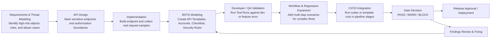
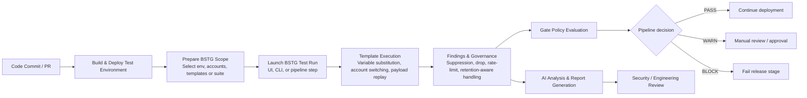
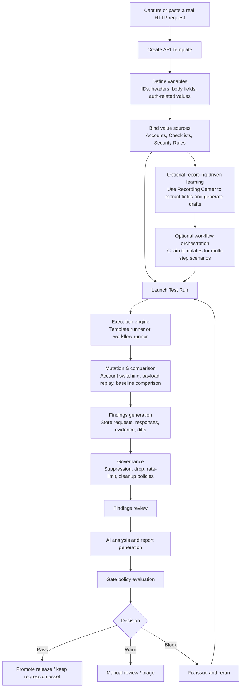

# Bola Security Test Gate

Bola Security Test Gate (BSTG) is a visual **API security testing console** for authorized environments. It helps teams turn real HTTP requests into **API templates**, launch repeatable **test runs**, collect **evidence-backed findings**, and apply **governance + CI gate policies** before results enter engineering pipelines.

> Use this project only against systems and environments where you have **explicit authorization**.

---

## Documentation & AI Assistant

BSTG does not try to put every concept into a static, feature-by-feature manual. Besides the repository docs, the project also provides a dedicated AI assistant intended to act as a living security expert for:

- installation and deployment
- configuration and troubleshooting
- workflow and variable modeling
- business-logic vulnerability testing ideas
- CI/CD integration strategies

Resources:

- **Assistant**: https://chatgpt.com/g/g-6947bdfc185481918368735a56c613c4-bola-security-test-gate-assistant
- **Feedback Group**: https://chatgpt.com/gg/v/6949298429288198be46b0a7b879b7ad?token=VkESJJtq2d9ZZgWI4IytDA

---

## What BSTG is for

BSTG is an **API security testing console** centered on **API Templates** and **Test Runs**.

The core workflow is straightforward:

1. capture or paste a real HTTP request
2. turn it into an **API Template**
3. mark important fields as variables
4. bind those variables to accounts, checklists, or security-rule payloads
5. launch a **Test Run** against a target environment
6. review findings, evidence, and governance results

This makes BSTG especially useful for recurring API security scenarios such as:

- BOLA / IDOR / object-level authorization checks
- multi-account access-control testing
- parameter tampering and hostile input replay
- baseline-versus-variant response comparison
- repeatable regression testing for high-risk endpoints
- evidence collection suitable for review, triage, and CI/CD gate decisions

## Core product model

BSTG is built around a small set of reusable objects:

- **Environments**: target base URLs and active runtime targets
- **Accounts**: test identities, credentials, auth metadata, and reusable fields
- **API Templates**: reusable raw HTTP request templates with variable substitution
- **Checklists**: value pools for IDs, inputs, and enumeration data
- **Security Rules**: payload sets used for mutation and hostile input testing
- **Test Runs**: execution records for launching one or more API templates against an environment
- **Findings**: evidence-rich results generated by runs
- **Governance**: suppression, drop, rate-limit, cleanup, and retention controls
- **Gate Policies**: pass/warn/block decisions for CI/CD
- **Recording Sessions**: captured traffic turned into draft templates and presets
- **Workflows**: advanced multi-step scenarios built on top of templates when a single request is not enough

In day-to-day use, BSTG is primarily a **single-interface API testing product**. Workflows, recordings, presets, AI analysis, and gate policies extend that core loop rather than replacing it.

## Key capabilities

### 1. Environment management
Define and manage target environments such as dev, staging, or pre-prod. BSTG uses environment base URLs when executing templates and workflows.

### 2. Test account management
Store test identities with fields, auth-related metadata, and variables. This is a core capability because many scenarios depend on switching between attacker/victim or role-based accounts.

### 3. API template modeling and execution
Model raw HTTP requests as reusable templates. Templates support variable substitution, body/path/header mutation, account binding strategies, failure patterns, and baseline comparison options.

### 4. Test Runs for formal single-interface execution
Launch one or more API templates as a tracked run against a selected environment and optional accounts. Test Runs persist progress, errors, findings, and evidence links so repeated testing stays reviewable over time.

### 5. Recording-driven asset generation
Capture traffic through the Burp recorder plugin, ingest it into BSTG, and turn it into draft API templates or run presets. This bridges manual exploration and reusable automated tests.

### 6. Findings with evidence
Store findings together with raw requests, response status, headers, response bodies, baseline/mutated comparisons, attribution metadata, and optional AI analysis.

### 7. Governance and noise control
Apply suppression rules, drop filters, rate limits, retention policies, and cleanup. This helps keep result volume manageable in long-running or repeated testing.

### 8. Workflow support for advanced scenarios
Build multi-step security test flows such as login → extract token → call protected resource → assert response → compare to baseline. Workflows support extractors, assertions, session propagation, workflow context, and variable learning.

### 9. CI/CD gate enforcement
Run suites or template-based checks and translate results into **PASS / WARN / BLOCK** decisions using configurable gate policies.

### 10. AI-assisted analysis and reporting
Configure one or more AI providers, analyze findings, and produce summary reports from normalized evidence.


## How BSTG fits into SDLC and CI/CD

BSTG is most effective when used as an **API security test stage that sits between API implementation and release approval**. In practice, teams usually connect it to SDLC in two ways:

- **during feature delivery**: capture or model important API requests, define templates, and build reusable checks for high-risk endpoints
- **during CI/CD**: run those checks automatically against dev, staging, or pre-production environments, then turn findings into pass/warn/block outcomes through gate policies

### SDLC insertion points



### What gets inserted at each stage

| SDLC stage | What BSTG contributes | Primary BSTG objects |
|---|---|---|
| Requirements / threat modeling | Turn risky abuse cases into concrete API checks | checklist ideas, security rules, account roles |
| API design | Decide which endpoints need authorization regression coverage | environments, accounts, template targets |
| Implementation | Capture real HTTP requests from app/API development | recordings, API templates |
| Developer / QA validation | Replay important requests with alternate IDs, accounts, and payloads | test runs, findings |
| Security regression | Preserve checks for repeated execution across versions | templates, presets, suites |
| CI/CD | Execute formal checks in pipeline and evaluate release readiness | test runs, gate policies |
| Release / post-fix verification | Confirm fixes and prevent regressions | rerun templates, findings, reports |

### CI/CD integration view



In a typical team workflow, BSTG is introduced after a runnable API exists, then becomes part of the release pipeline for endpoints that need repeated authorization or tampering regression checks.

## BSTG end-to-end operating logic

BSTG follows a closed loop from request acquisition to release decision. The diagram below shows the normal product flow for the most common usage model: **single-interface API template testing first, then optional workflow expansion, then governance, reporting, and gate enforcement**.



### Closed-loop stages explained

1. **Model the request**
   Start from a real API request and convert it into an API Template. This is the main entry point of the product.

2. **Mark what should vary**
   Choose which path values, IDs, headers, body fields, or auth-related fields should be replaced during testing.

3. **Bind test data sources**
   Link variables to:
   - **Accounts** for identity and auth-context switching
   - **Checklists** for enumerated values such as IDs or boundary inputs
   - **Security Rules** for payload-driven hostile input replay

4. **Record and learn when helpful**
   Use Recording Center when the fastest path is to capture traffic first and generate drafts, field candidates, and reusable presets from real activity.

5. **Run single-interface tests or expand to workflows**
   The most common path is to launch a **Test Run** directly from API Templates. For complex multi-step flows, templates can be composed into Workflows.

6. **Generate evidence-backed findings**
   BSTG stores request/response material, baseline comparisons, and other execution context so the result can be reviewed instead of treated as a black-box alert.

7. **Reduce noise and preserve signal**
   Governance controls decide what should be suppressed, dropped, rate-limited, or retained.

8. **Explain and report**
   AI analysis and reports help summarize technical findings into a format that security and engineering teams can consume faster.

9. **Turn results into release decisions**
   Gate policies convert findings into PASS / WARN / BLOCK outcomes for CI/CD and release review.

10. **Keep the asset and rerun it later**
   The same template, preset, suite, or workflow can be reused as a regression check in future delivery cycles.

## Frontend and backend responsibilities

### Frontend
The frontend is a React + Vite control console. It is responsible for:

- managing all primary entities
- launching runs and reviewing status
- reviewing findings and evidence
- governing suppression/drop/rate-limit policies
- configuring AI providers and AI analysis jobs
- inspecting recording sessions and publishing generated drafts

The app is organized as a single console with pages such as:

- Dashboard
- Environments
- Accounts
- API Templates
- Template Variable Manager
- Checklists
- Security Rules
- Workflows
- Recording Center / Recording Detail
- Preconfigured Runs
- Test Runs
- Findings
- Findings Governance
- CI Gate Policies
- Security Suites
- Debug Panel
- Field Dictionary
- AI Providers / AI Analysis / AI Reports

### Backend
The backend is where most of the core behavior lives. It is responsible for:

- CRUD APIs for assets and configuration
- template execution
- workflow execution
- variable resolution and context propagation
- findings generation
- suppression/drop/rate-limit enforcement
- retention and cleanup
- recording ingestion and draft generation
- learning assistance for workflow mappings
- database profile management
- gate execution for CI/CD
- AI input preparation and report generation

---

## Functional overview by module

### Dashboard
Provides the operational summary of the system: recent runs, recent findings, inventory counts, mutation health, and workflow/baseline consistency signals.

### Environments
Stores target endpoints and active base URLs used during execution. This is the minimum target abstraction required for running tests against different stages.

### Accounts
Stores test identities and identity-linked metadata. Accounts are more than username/password records: they act as containers for auth state, variables, and role-specific values that workflows or templates can reference.

### API Templates
Defines reusable request templates based on raw HTTP. Templates support variable placeholders, different binding strategies, baseline compare options, failure pattern detection, and value injection from accounts, checklists, or security rules.

### Template Variable Manager
Provides a centralized way to inspect and adjust variable definitions across templates. This is useful when the project scales from a few requests to a broad template catalog.

### Checklists
Stores reusable value sets. These are often used for object IDs, parameter values, boundary inputs, or other enumerable data sources.

### Security Rules
Stores reusable payload groups for hostile input testing. In the current implementation, they behave more like curated payload sets than a full rule engine.

### Workflows
This is one of the core modules of the platform. Workflows orchestrate multiple request templates into stateful scenarios. They support:

- ordered steps
- extractors from body/header/status/regex
- assertions against literal values or workflow variables
- context propagation between steps
- cookie/session jar handling
- baseline vs mutation modeling
- mapping and learning assistance
- concurrency/replay-oriented mutation behavior in advanced paths

This design makes BSTG suitable for modeling access-control issues, state transitions, and multi-step abuse cases.

### Recording Center
The recording subsystem ingests captured traffic, usually from the Burp recorder plugin, and turns it into structured sessions. Those sessions can then generate workflow drafts, API drafts, test-run presets, candidate fields, and linkage hints.

### Recording Detail
Lets operators inspect a single session in depth: captured events, extracted fields, candidate mappings, generated drafts, account linkage suggestions, regeneration, publish flow, and audit/observability data.

### Preconfigured Runs
Acts as the review-and-promotion workspace for API recordings. A recorded API draft can be edited here, then promoted into one or more formal assets:

- an API template
- a reusable preset
- a formal test run record

This page is intentionally *before* Test Runs in the lifecycle. It is where recorded traffic becomes something operators can approve, edit, and publish.

### Test Runs
Test Runs is the page for launching and reviewing **formal API template executions**. In the most common path, an operator selects one or more API templates, chooses an environment, optionally binds accounts, and starts a tracked run.

A run stores:

- the selected template IDs
- the target environment
- any bound account IDs
- live progress and execution status
- findings created during execution
- execution errors and governance counters

The same data model can also store workflow-based runs, but the main product meaning of Test Runs is still **single-interface template execution**. It is the operational page where API template tests are started, monitored, and reviewed.

### Findings
Stores evidence-backed results rather than only simple alert text. Findings can include request/response material, account source mapping, baseline comparison, diff-like evidence, and optional AI evaluation results.

### Findings Governance
Implements operational controls such as suppression rules, drop rules, retention policies, cleanup, and rate limiting.

### CI Gate Policies
Defines how findings become engineering decisions. Gate policies can weigh different classes of findings and return pass/warn/block outcomes.

### Security Suites
Packages environments, accounts, templates, rules, checklists, and workflows into reusable execution bundles for repeatable testing and CI use.

### Debug Panel
Provides execution trace visibility for troubleshooting. This is especially valuable when variable mapping, extractor behavior, or unexpected responses make automated tests hard to reason about.

### Field Dictionary
Defines semantic field classification rules used by learning and recording-related components. Categories such as AUTH, IDENTITY, OBJECT_ID, FLOW_TICKET, or NOISE help the system reason about captured data.

### AI Providers / AI Analysis / AI Reports
Abstract AI provider configuration from finding analysis and report generation. The platform supports pluggable providers and a normalized evidence-to-prompt pipeline.

---

## Architecture and execution flow

### Normal execution flow
1. Create environments, accounts, templates, and optionally workflows.
2. Create or reuse a **formal test run record** from the UI, from a preset, from a suite launch, or from recording promotion.
3. The backend resolves variables and account/context bindings from that run record.
4. The template runner or workflow runner executes requests against the run's bound scope.
5. Findings are generated from abnormal or policy-relevant results.
6. Governance layers can suppress, drop, or throttle findings.
7. The completed run persists status, progress, errors, and source tracing, and can feed Findings, AI analysis, and gate decisions.

### Recording-driven flow
1. Create a recording session.
2. Capture traffic with the Burp recorder plugin.
3. Ingest batched request/response events into BSTG.
4. Extract candidate fields, contexts, and linkage hints.
5. Generate workflow drafts or API-oriented test-run drafts.
6. Review those drafts in Recording Detail / Preconfigured Runs.
7. Publish them into reusable assets such as workflows, templates, or presets, or promote an API draft directly into a **formal test run**.

### AI-assisted analysis flow
1. Choose a run and an AI provider.
2. BSTG builds normalized evidence input from findings.
3. The provider returns analysis or report content.
4. Results are stored and rendered in the console.

---

## Repository structure

```text
BSTG/
├── src/                      # Frontend application (pages, components, API client)
├── server/                   # Backend APIs, DB providers, runners, services
├── cli/                      # Command-line runner integration for CI/CD
├── burp-recorder-plugin/     # Burp Suite recorder extension
├── docs/                     # Project documentation
├── docs_CH/                  # Chinese documentation
├── docs_EN/                  # English documentation
├── tests/                    # Project tests and smoke scripts
├── scripts/                  # Helper scripts
├── USER_GUIDE.md             # User-focused guide
├── PROJECT_STRUCTURE.md      # Repository structure notes
└── README.md                 # This file
```

Important runtime code locations:

- `src/pages/*` — console pages and feature entry points
- `server/src/routes/*` — API surfaces
- `server/src/services/template-runner.ts` — template execution engine
- `server/src/services/workflow-runner.ts` — workflow execution engine
- `server/src/services/recording-service.ts` — recording/session orchestration
- `server/src/services/learning-engine.ts` — mapping and variable-learning support
- `server/src/services/gate-runner.ts` — CI gate logic
- `server/src/db/*` — database providers and DB profile logic

---

## Tech stack

### Frontend
- Vite
- React 18
- TypeScript
- Tailwind CSS

### Backend
- Node.js
- Express
- TypeScript

### Data storage
- default local SQLite
- optional Postgres
- optional Postgres profile support for shared/team deployments

> SQLite is the default out-of-the-box storage path.

---

## Quick start (development)

### Requirements
- Node.js **18+** recommended
- npm
- Java/Maven only if you want to build the Burp recorder plugin

### Install dependencies

At the repository root:

```bash
npm ci
```

For the backend:

```bash
cd server
npm ci
```

### Configure environment variables

Frontend (repository root `.env`):

```bash
VITE_API_URL=http://localhost:3001
```


Backend variables are read from `process.env`. Common runtime values include:

```bash
PORT=3001
CORS_ORIGIN=*
CLEANUP_INTERVAL_HOURS=4320
```

Optional advanced values may be required for specific modules such as recording, CLI, debugging, or AI integrations.

> **Important:** the backend reads from `process.env`, but the server entry path does not automatically bootstrap `dotenv` for `server/.env`. In practice you should inject backend variables through your process manager, shell, Docker/Compose, CI secrets, or an explicit Node env-file mechanism.

### Run the platform

Open two terminals.

Backend:

```bash
cd server
npm run dev
```

Frontend:

```bash
npm run dev
```

Default URLs:

- Frontend: `http://localhost:5173`
- Backend: `http://localhost:3001`
- Health check: `GET http://localhost:3001/health`

### Default database behavior

By default the backend creates local SQLite databases under `server/data/`:

- `server/data/app.db`
- `server/data/meta.db`

This makes local development straightforward without extra infrastructure.

---

## Environment variables and deployment notes

BSTG contains several environment-variable entry points across the frontend, backend, recorder, and CLI-related code. Not every variable is required for every deployment.

### Frontend
Common:

- `VITE_API_URL` — backend API base URL used by the frontend

The current frontend runtime path only requires `VITE_API_URL`.

### Backend common runtime
- `PORT`
- `CORS_ORIGIN`
- `CLEANUP_INTERVAL_HOURS`

### Recording-related backend variables
Depending on how you deploy the recording subsystem, the codebase includes support for values such as:

- `RECORDING_API_KEY`
- `RECORDING_ADMIN_API_KEY`
- `RECORDING_ROLLOUT_PHASE`
- recorder-related ingress/rate-limit controls

### Debug/trace-related variables
The codebase also supports debug-trace controls such as:

- `DEBUG_TRACE_MAX_BODY_CHARS`
- `DEBUG_TRACE_MAX_TRACE_CHARS`
- `DEBUG_TRACE_REDACT_HEADERS`

### CLI-related values
The CI runner path may require:

- `SEC_RUNNER_BASE_URL`
- `SEC_RUNNER_API_KEY`

### Database values
The repository includes DB profile support for SQLite and Postgres, and you may encounter variables such as:

- `DB_TYPE`
- `DB_PATH`
- `POSTGRES_HOST`
- `POSTGRES_PORT`
- `POSTGRES_DB`
- `POSTGRES_USER`
- `POSTGRES_PASSWORD`

However, database switching is not simply “set one variable and all runtime code changes automatically.” The platform includes **database profile management** and uses SQLite by default.

### AI provider values
AI providers are primarily configured through the application itself, but production deployments should still treat provider keys as secrets and inject them securely.

### Recommended deployment practice
- keep committed example files free of real secrets
- inject backend runtime variables outside the repo
- use SQLite for quick local startup
- move to Postgres only when you need shared/team deployment characteristics

---

## Database profiles and admin APIs

BSTG supports multiple database profiles through admin APIs and DB provider services.

Examples of related admin capabilities:

- view DB status
- create or list DB profiles
- switch active profile
- run migrations/import/export

The supported profile types include:

- `sqlite`
- `postgres`

> When active runs are in progress, DB switching should be treated as an administrative operation and may be rejected to protect runtime consistency.

---

## Burp recorder integration

The repository includes a Burp Suite extension under `burp-recorder-plugin/`.

### What it does
- captures HTTP request/response traffic in Burp
- creates and updates BSTG recording sessions
- batches event delivery to the BSTG backend
- provides local buffering/queueing behavior
- exposes a dedicated Burp-side UI tab for recorder control

### Build the plugin

```bash
cd burp-recorder-plugin
mvn clean package
```

The resulting JAR is generated under `target/`.

### Install into Burp
1. Open Burp Suite.
2. Go to **Extensions** → **Installed**.
3. Add the generated JAR.
4. Confirm the BSTG recorder tab appears.

### Typical recorder settings
- **Server URL**: BSTG backend URL, such as `http://localhost:3001`
- **API Key**: a recorder API key configured for BSTG
- **Mode**: `workflow` or `api`
- **Environment ID**: target BSTG environment
- **Account ID**: relevant test account when applicable

### Recorder workflow
1. Create or choose the target environment and account in BSTG.
2. Start a recording session.
3. Interact with the application through Burp.
4. Stop the recorder and review the session in BSTG.
5. Generate drafts and publish reusable assets.

---

## CLI and CI/CD usage

The repository contains a CLI runner under `cli/sec-runner`. Its purpose is to let CI jobs execute suites or gate checks against BSTG and return machine-usable outcomes.

Typical responsibilities include:

- contacting the BSTG backend
- launching runs or gate checks
- receiving pass/warn/block style outcomes
- generating machine-readable result artifacts

This is the preferred path when you want BSTG to participate in automated pipelines rather than only interactive UI sessions.

---

## Common scripts

### Frontend (repository root)

```bash
npm run dev
npm run build
npm run preview
npm run lint
npm run typecheck
npm run check:recording:unit
npm run smoke:recording:doc10
npm run migrate:recording  # cross-platform (Windows / Linux / macOS)
```

### Backend (`server/`)

```bash
npm run dev
npm run build
npm run start
npm run typecheck
```

---

## Security and operational guidance

- use BSTG only with explicit written authorization
- do not commit real secrets, tokens, or production credentials
- treat account fixtures and recorder data as sensitive
- place the backend behind your own access control before exposing it on any shared network
- review recorder and admin capabilities carefully in multi-user environments

A notable operational point: the recording subsystem has explicit rollout, guard, and observability components. That means it is intended to be controlled, monitored, and selectively enabled rather than exposed casually.

---

## Current strengths and known design characteristics

### Strengths
- strong workflow-oriented testing model for business logic and authorization scenarios
- recording-to-draft pipeline that reduces manual modeling effort
- evidence-rich findings instead of shallow alert output
- governance and CI gate features built into the platform rather than added later
- support for both local SQLite usage and more advanced DB profile setups

### Design characteristics to understand before deployment
- the frontend is a console-style single application rather than a heavily routed SPA
- several backend services are feature-rich and large, especially execution and recording modules
- deployment requires deliberate handling of backend environment injection
- governance and admin features are powerful and should be protected accordingly

---

## Additional documentation

- `USER_GUIDE.md` — user-oriented guide and walkthroughs
- `docs/` — main supporting docs
- `docs_CH/` — Chinese docs
- `docs_EN/` — English docs
- `burp-recorder-plugin/README-BUILD.md` — plugin build details
- `cli/sec-runner/README.md` — CLI notes

---

## Contributing

1. Create a branch for your change.
2. Keep frontend and backend type checks green.
3. Document user-facing behavior changes clearly.
4. For changes in runners, recording, or governance, include validation notes or smoke-test guidance.

---

## Summary

BSTG is best understood as a **security testing control plane** for authorized Web/API targets. It combines reusable request modeling, stateful workflow execution, captured-traffic-to-test conversion, evidence-backed findings, governance, AI-assisted analysis, and CI gate enforcement in one console-driven platform.

## 🚀 Deployment

Use the project root as a full-stack deployment target. The backend serves both the frontend and API routes.

### Windows

```powershell
./deploy.ps1
```

### Linux / macOS

```bash
./deploy.sh
```

Run `node ./scripts/post-deploy-check.mjs` after startup to verify key endpoints.

