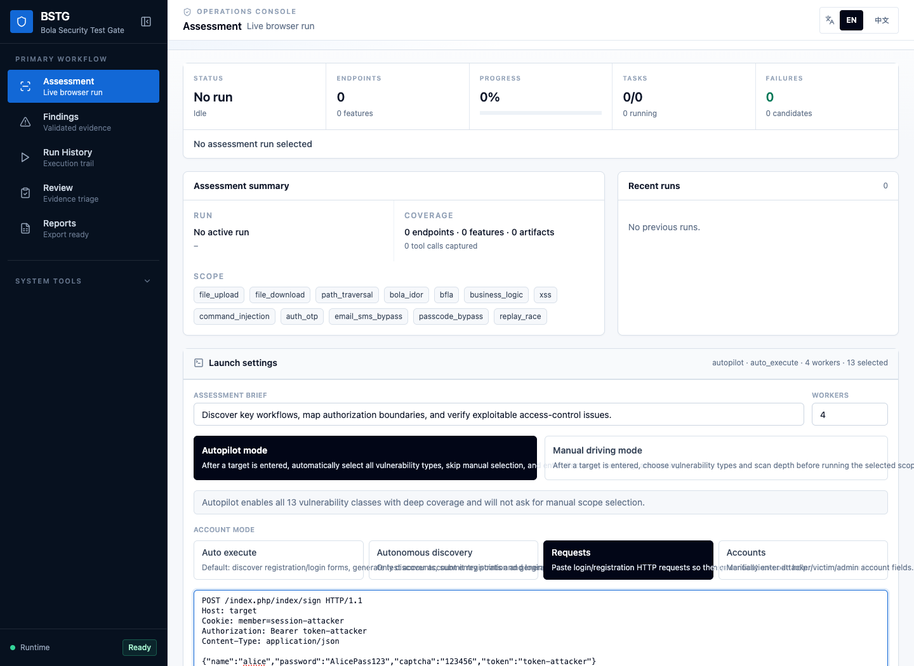
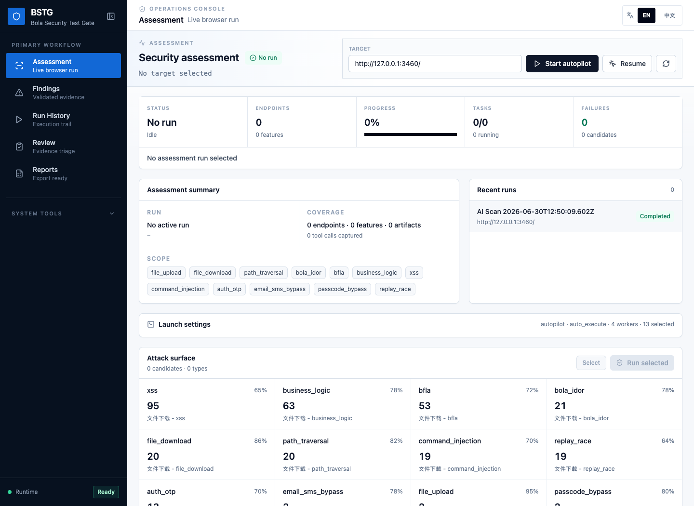

# BSTG Dou Dizhu Autopilot Demo Report

Date: 2026-06-30  
BSTG version: v0.3.2 (`e3a1efc`)  
Mode: browser UI autopilot  
Target: authorized local vulnerable Dou Dizhu demo target  
Full machine-readable result: [JSON report](../../tests/ai-scan/reports/doudizhu-autopilot-ui-public-demo-2026-06-30.json)

This report shows what Bola Security Test Gate can do against a controlled local target where testing is explicitly authorized. It is not a claim about any third-party production system.

## Browser-Driven Run

BSTG was operated through the frontend, not by directly seeding backend state. The run started from the Assessment page, accepted a target URL, used raw HTTP account material for attacker context, selected autopilot mode, and let BSTG discover, model, execute, and record evidence.

Before starting the run:

After the autopilot run completed:

## Closed-Loop Result

| Metric | Result |
|---|---:|
| Source-derived route count | 92 |
| Endpoints discovered by BSTG | 99 |
| Executable tasks created | 101 |
| Tasks completed | 101 |
| Failed tasks | 0 |
| Confirmed findings | 21 |
| Native BSTG execution artifacts | 72 |
| Native API test run artifacts | 101 |
| Native workflow verification artifacts | 72 |
| AI provider judgement artifacts | 72 |
| Fallback decisions | 0 |

## Assets Created

| Asset type | Count |
|---|---:|
| API templates | 938 |
| Workflows | 216 |
| Workflow steps | 736 |
| Security rules | 173 |
| Checklists | 103 |
| Accounts | 3 |
| Test runs | 490 |
| Findings | 21 |

## Vulnerability Coverage

Autopilot selected and covered all 13 requested vulnerability classes. The coverage matrix reported no missing vulnerability types.

| Vulnerability class | Executable tasks | Candidates |
|---|---:|---:|
| file_upload | 4 | 2 |
| file_download | 5 | 20 |
| path_traversal | 5 | 20 |
| bola_idor | 8 | 21 |
| bfla | 8 | 53 |
| business_logic | 9 | 63 |
| xss | 20 | 95 |
| command_injection | 7 | 19 |
| auth_otp | 14 | 13 |
| email_sms_bypass | 5 | 3 |
| passcode_bypass | 4 | 2 |
| replay_race | 6 | 19 |
| state_machine_race | 3 | 2 |

## Confirmed Findings

BSTG confirmed 21 evidence-backed findings:

| Severity | Count |
|---|---:|
| critical | 1 |
| high | 13 |
| medium | 7 |

Representative finding categories included:

- file upload accepted unsafe content
- BOLA/IDOR exposed another user's room object
- BFLA allowed non-admin access to an admin function
- OTP or SMS-like verification accepted weakly bound codes
- business-logic and race paths accepted negative quantity behavior
- command injection produced local command output inside the authorized demo
- file download and path traversal exposed local fixture file content
- state-machine race behavior replayed unsafe game-room state

Every confirmed finding in this run was backed by native BSTG evidence.

## What This Demonstrates

This run demonstrates that BSTG can move from a target URL to a complete API security testing loop:

1. Discover browser-visible attack surface and API-like routes.
2. Generate vulnerability candidates across multiple vulnerability families.
3. Expand selected classes into executable tasks.
4. Build reusable API templates, workflows, rules, checklists, accounts, and test runs.
5. Execute native BSTG tests instead of stopping at a text-only AI hypothesis.
6. Preserve screenshots, artifacts, findings, and a machine-readable JSON report.
7. Produce evidence that can be reviewed, governed, and reused for regression testing.

## Reproduction Boundary

Use BSTG only against systems where you have explicit authorization. The target used for this report was a local vulnerable demo application controlled for product validation. The public value of the report is the workflow and evidence model, not the specific vulnerable target.
