# 面向真实业务流程的 Agent 执行架构与外部运行时评估

基线：`12c556e8299b61d131b781beceffcd5e38876504`（0.6.14）。本轮范围是从发现业务、学习正常流程、设计并执行实验，到形成可审查证据的闭环；不包含 CI/CD 产品改造。

## 结论

BSTG 的核心价值不是“能点浏览器”，而是把一次浏览器观察沉淀为可复现的原生 API Template、Workflow、Test Run 和证据链。外部 `computer-use-offline-linux-x86_64` 包则是一个成熟的 Linux 虚拟桌面执行器：它提供 Chromium、Xvfb、PyAutoGUI、Playwright、截图和 noVNC，但不含模型、业务规划、工作流、账号/对象语义、漏洞判定或证据模型。

因此不应把外部 rootfs 或 PyAutoGUI 运行时直接嵌入 BSTG 服务器，更不应以它替换 BSTG 的 Playwright/CDP、Workflow 或 Test Run。当前实现让模型通过受约束的原生工具真正决定业务学习与实验；外部运行时保留为将来可选的“远程桌面执行器适配器”，用于 DOM/选择器不可用时的视觉坐标回退和可移植 Linux 演示环境。

## 现在的职责边界

```mermaid
flowchart LR
  D[页面、导航、表单、网络观察] --> C[模型：发现、覆盖决策、业务目标]
  C --> F[Business Flow]
  F --> R[浏览器录制：真实有序请求/响应]
  R --> W[原生 Template / Workflow / 动态映射]
  W --> N[正常流程 Test Run 与语义断言]
  N --> P[模型：具体实验计划]
  P --> X[编译：control 与 experiment Workflow]
  X --> T[新鲜的原生 Test Run]
  T --> E[对照、影响、身份与证据门禁]
  E --> S[安全产品投影与人工复核]
```

模型负责业务判断，而不是只发起一个固定规则：

- 对当前发现的每个可操作 feature/endpoint，选择建立正常业务 Flow，或写明 `deferred` / `blocked` 的具体理由；非空 Flow 列表不能冒充覆盖完成。
- 为 Flow 定义正常状态、角色、前置条件和语义成功条件，启动真实浏览器录制，选择何时停止并检查录制结果。
- 在原生 Workflow 结构、字段形状、动态依赖和可用身份上，选择实验的步骤、请求补丁、动态绑定、角色、重复次数、并发以及 control/impact 断言。
- 根据实际执行结果修订计划或给出 `vulnerable`、`not_vulnerable`、`inconclusive` 结论。

确定性层不是替模型猜测漏洞类别的替代品。它只负责把模型选择编译成可执行的原生资产，隔离控制组与实验组，保护凭据和原始流量，并拒绝没有完整证据的结论。

## 实现的业务闭环

| 阶段 | Agent 原生工具 | 实际产物与门禁 |
| --- | --- | --- |
| 业务覆盖 | `bstg.business.coverage.inspect` / `save`、`flow.define` | 保存 append-only 覆盖清单；每个发现目标恰好一次，且必须映射到 Flow 或具体阻塞/延期原因。发现集变化会使旧清单失效。 |
| 正常流程学习 | `capture.start` / `stop` / `inspect`、`workflow.prepare` / `inspect` / `validate` | 浏览器真实事件按顺序保存为私有录制；录制生成已有 Template、Workflow、动态变量和映射；模型先检查**当前** Workflow，再自行选择语义断言、映射和会话传播，最后用新的 Test Run 验证正常业务语义。 |
| 实验设计 | `test_plan.create` / `compile` / `execute` / `inspect` / `assess` | 模型保存带 revision 的计划；编译为独立 control/experiment Workflow；每次执行产生新的 Test Run 和私有 trace。 |
| 证据裁决 | `assess` 与任务完成门禁 | 结论必须回查同一 scan、当前 revision、真实 Workflow/Test Run、终态、trace 和 evidence 引用。`not_vulnerable` 还需要真正通过的 control 与 `counterexample_verified`。 |
| 产品展示 | Product projection / Assessment Workspace | 只显示正常流程、实验、证明摘要、阻塞原因与安全引用；原始抓包、Cookie、动态值、请求体和私有 trace 不进入产品 DTO。 |

实现细节包括：

- 正常流程验证返回 `verified: false` 时，运行时会进入修订/重验路径，不会因工具调用本身成功而把 Flow 标记完成。
- 只要验证生成新的正常执行快照，先前的 Workflow 检查就不再满足当前证明；策略会要求模型检查新快照，再由模型补全断言、映射和会话传播后重验，避免停在重复 `workflow.inspect`。
- `capture.stop` 的持久化输出和策略读取已统一；录制停止后才会准备 Workflow。
- 实验状态依据**当前计划 revision**和该 revision 的实际结果推进，旧 invocation 不会让新计划误完成。
- `control_role` 真实决定 control Workflow 和 control Test Run 使用的账号；实验角色与控制身份保持分离。
- 被服务器拒绝的变异可形成安全反例，但不能被误报为漏洞；有影响的结果也不能被模型任意标作 `not_vulnerable`。
- 工作流运行支持表单编码动态映射、同会话真实 `Set-Cookie → Cookie` 推断、重复事件保留、并发 trace 归属和深层数据脱敏。模型可见的捕获 URL 只保留 origin、路由形状和查询字段名，路径对象值留在私有录制中。
- 通用扫描 snapshot、扫描列表、同步 `/run` 返回、记忆/修订、浏览器上下文、模型决策和 Agent 事件流均只返回安全技术投影。产品证据接口只展示状态、哈希、是否保存正文和字节数；响应正文与私有诊断仍留在受保护执行存储。
- 证据下载默认是可审计的安全清单。受底层密钥掩码保护的原始执行材料只有在请求 `?raw=true`、服务器设置 `BSTG_ENABLE_RAW_EVIDENCE_EXPORT=true`，并且请求带有与 `BSTG_RAW_EVIDENCE_EXPORT_TOKEN` 相符的 `Authorization: Bearer …` 时才会导出。
- debug 的 `raw` / `http` 导出同样同时要求 `BSTG_ENABLE_RAW_DEBUG_TRACE_EXPORT=true` 和与 `BSTG_RAW_DEBUG_TRACE_EXPORT_TOKEN` 相符的 Bearer token；其余 debug 格式始终是安全技术投影。

### 为什么这不是“AI 外壳 + 固定规则”

以前的风险确实存在：若系统仅把“登录、越权、重放”等固定模板交给执行器，AI 只是一个表层调度器。现在模型面对的是 Flow、Workflow 结构、字段形状、已有映射、账户角色、运行事实和缺失证据；它要自己给出精确的实验参数。系统不内置“登录必测哪几个 payload”或“任意 4xx 等于安全”的策略。

系统仍然保留不可绕过的事实约束：模型不能读取私有原始请求值，不能伪造 Test Run 或 evidence ID，不能仅凭猜想创建确认发现，也不能以旧录制替代新鲜 control/experiment 执行。这些是证据完整性要求，不是替代模型的测试策略。

## 既有原生资产为何应保留为第一执行路径

| 能力 | BSTG 当前路径 | 对业务安全测试的意义 |
| --- | --- | --- |
| 页面操作与网络观察 | Node Playwright、持久浏览器运行时、CDP 观察 | 直接关联页面动作、网络事件和身份上下文。 |
| 可重放业务请求 | Recording → Template → Workflow → Test Run | 能把一次真实正常流程转为可审计、可变异、可比较的原生执行。 |
| 动态数据与会话 | 动态映射、账号绑定、同会话 Cookie 事实 | 避免用过期字面量或凭猜测重放业务链路。 |
| 对照与判定 | 独立 control/experiment 工作流、语义断言、证据门禁 | 不是看单个 HTTP 状态，而是检查业务对象、身份边界和影响。 |
| 产物治理 | SQLite 归属、revision、私有 trace、安全产品投影 | 能够复核结果且不把抓包直接泄露给产品界面或模型。 |

这意味着 Workflow/Test Run 不是历史遗留的“规则底层”。它们是模型计划的执行 IR（中间表示）和可验证证据载体。把模型计划直接改成任意浏览器鼠标动作会丢失最有价值的可复现性、控制组和证据归属。

## 对外部 `computer-use-offline-linux-x86_64` 包的静态审查

审查对象位于 `/Users/a0000/Downloads/computer-use-offline-linux-x86_64`。其 README 和代码明确说明它不是本地 Agents 平台，也没有模型或模型权重；它的职责是本机虚拟桌面的执行与观察。

| 维度 | 该包的实现 | 对 BSTG 的判断 |
| --- | --- | --- |
| 运行环境 | x86_64 Linux rootfs、Chromium 144、Python 3.13、Xvfb 1280×800、x11vnc/noVNC | 可移植的 Linux 交互演示环境有价值；当前 macOS 开发机不能直接运行。 |
| 浏览器与输入 | 一条 worker thread 持有 Playwright 浏览器；PyAutoGUI 发真实 X11 鼠标、键盘、拖拽、滚轮；Pillow 抓 X11 像素 | 对纯视觉页面、Canvas、非标准控件和选择器失效时有价值。 |
| 控制协议 | 本地回环 HTTP，bearer token、Host 校验、动作白名单：open/click/type/hotkey/scroll/state 等 | 可以借鉴动作契约、单线程所有权和启动自检；不是业务工作流 API。 |
| 可视化 | noVNC 展示同一个桌面，默认只读 | 适合作为人工观察/演示通道；不能成为漏洞证据来源。 |
| 自检 | `--isolated-test` 包含启动、实际键盘鼠标、截图、滚动、RFB/noVNC 检查 | 值得作为将来远程执行器的 readiness contract。 |
| 模型与业务语义 | 明确不含模型、规划、账号/对象语义、请求录制、Workflow、Test Run、漏洞判断 | 不能替代 BSTG 的 Agent 层或证据层。 |

包的 `VERSIONS.json` 列出 PyAutoGUI 0.9.54、Playwright Python 1.57.0、Chromium 144.0.7559.96。随附 `validation/test-results.json` 声明 Linux x86_64 隔离自检的八项检查均通过。这是包作者的机器可读验收记录，不是本轮在 macOS 上重新运行的结果。

完整性检查中，`PACKAGE-CONTENTS.sha256` 中所有当前可访问的列出文件均匹配；它期望的 `runtime-rootfs.tar` 已不在该目录，只有已展开的 `runtime-rootfs/`，因此不能重算并验证原始 tar 的哈希 `499d4042…24d293`。这不妨碍源码静态审查，但不构成该 rootfs 的完整性证明。

### 该包不能直接作为生产安全沙箱的原因

- 常规启动共享宿主网络；`--isolated-test` 只为自检创建 loopback-only network namespace，不是持续执行的网络策略。
- Chromium 使用 `--no-sandbox`。README 也明确要求在隔离虚拟机中处理不可信网页。
- noVNC/VNC 限制为 loopback，VNC 为经典短口令且没有额外 TLS，不能直接暴露到远程网络。
- 输出目录、浏览器 profile 和日志可能包含后续业务会话材料，必须按 BSTG 私有证据策略生命周期化清理。
- 只验证了指定 Linux x86_64 内核；README 明确未认证 macOS、Windows、Android 或 WSL2。

## 最佳集成方案

不直接迁移整个包，而是在真正需要时增加一个可替换的 `desktop_executor` 适配器：

1. **保留 BSTG 作为编排与证据所有者。** Agent 仍通过 Business Flow、Workflow、Test Run 和实验计划工作，执行器只能执行一个被批准的动作序列。
2. **把外部包部署在每次运行独立的 Linux VM/容器中。** 使用独立 profile、生命周期回收、出站网络 allowlist、资源限制和审计日志；不要把其 `--no-sandbox` + namespace 组合当作足够的隔离。
3. **定义窄接口而非 import rootfs。** 能力描述、启动自检、截图/状态、动作请求、取消、健康检查和受保护的 trace 上传即可。服务端只接收 opaque artifact reference 和经脱敏的观察摘要。
4. **设定回退顺序。** 先用 BSTG Playwright 的语义/选择器操作和 CDP 网络观察；只有定位器、DOM 或浏览器兼容性确实失败时，模型才可请求带截图依据的视觉坐标动作。坐标动作同样受 idempotency、时间预算和正常流程语义验证约束。
5. **重新进入原生验证。** 外部桌面完成的正常操作必须由 BSTG 录制/生成/验证，实验必须回到独立 control/experiment Test Run；截图或 noVNC 画面不能独自证明业务漏洞。
6. **先做 Linux 端验收再产品化。** 需要验证启动、隔离、截图、动作、崩溃回收、CDP/请求采集桥接、动态会话、失败回退和证据归属。通过后再暴露为部署选项。

这能吸收外部包最有价值的部分：可重复 Linux 桌面、真实坐标输入、实时观察和自检；同时不会复制其不具备的 Agent、业务语义和证据系统，也不会制造两套互相脱节的浏览器执行路径。

## 本轮验证记录

已在本机完成的定向验证：

| 命令 | 结果 | 覆盖内容 |
| --- | --- | --- |
| `node --import ./tests/mobile-closure/register.mjs --test ./tests/agent-business/business-experiment.test.mjs` | 7/7 通过 | 模型计划编译、真实 control role、证据门禁、安全反例与防止伪造 `not_vulnerable`。 |
| `node --import ./tests/mobile-closure/register.mjs --test ./tests/agent-business/business-capture.test.mjs` | 4/4 通过 | 登录、资料、购物车、购买、身份变化、CSRF/session 的真实浏览器录制与原生重放；11 个观察请求、6 个选择步骤、5 个动态映射，以及对象路径值不进入模型输出。 |
| `node --import ./tests/mobile-closure/register.mjs --test ./tests/agent-business/business-task-lifecycle.test.mjs` | 15/15 通过 | 覆盖门禁、失败适配、停止状态、revision、当前 Workflow 检查与真实原生资产归属。 |
| `node --import ./tests/mobile-closure/register.mjs --test ./tests/agent-business/native-asset-tools.test.mjs` | 1/1 通过 | 原生 Template/Workflow/Test Run 的作用域和安全投影。 |
| `node --import ./tests/mobile-closure/register.mjs --test ./tests/agent-business/public-boundary.test.mjs` | 3/3 通过 | snapshot、debug、记忆、上下文、模型决策、证据清单和事件流不泄露请求体、Cookie、动态值或私有诊断。 |
| `node --import ./tests/mobile-closure/register.mjs --test ./tests/product-experience/business-product-repository.test.mjs ./tests/product-experience/business-flow-projection.test.mjs` | 25/25 通过 | 产品投影、证据时序与确认风险条件。 |
| `node --import ./tests/mobile-closure/register.mjs --test ./tests/agent-business/*.test.mjs` | 30/30 通过 | 业务闭环、当前 Workflow 策略、原生资产、捕获路径脱敏和公共边界总回归。 |
| `npm run test:product:experience:adapters` | 502/502 通过 | 最终代码的产品适配器回归，包括真实 Chromium 选择器、业务流程投影、证据展示、账户、范围和原生执行路径。 |
| `npm --prefix server run typecheck`、`npm run typecheck`、`npm run build` | 通过 | 服务端/前端 TypeScript 与生产构建。 |

此前同一变更集还完成了 101/101 回归和 6 项 React/Chromium 产品 UI 检查。

## 尚未声称完成的验证

- 当前环境没有配置可供该项目调用的真实模型 provider，因此没有把“最新远端模型”冒充为已经通过真实端到端业务验收。合约、执行、证据和受控浏览器路径已测试；接入配置后应使用目标 provider 做一轮多业务域的真实验收。
- 外部运行包因目标为 Linux x86_64，未在这台 macOS 主机执行。静态文件和自带历史验收记录已审查；若采纳适配器，必须在目标 Linux 隔离环境重跑其自检与 BSTG 桥接验收。
- CI/CD 后处理按本轮范围未改动。
