# 面向真实业务流程的 Agent 执行架构与外部运行时评估

基线：`12c556e8299b61d131b781beceffcd5e38876504`（0.6.14）。本轮范围是从发现业务、学习正常流程、设计并执行实验，到形成可审查证据的闭环；不包含 CI/CD 产品改造。

## 结论

BSTG 的核心价值不是“能点浏览器”，而是把一次浏览器观察沉淀为可复现的原生 API Template、Workflow、Test Run 和证据链。外部 `computer-use-offline-linux-x86_64` 包则是一个成熟的 Linux 虚拟桌面执行器：它提供 Chromium、Xvfb、PyAutoGUI、Playwright、截图和 noVNC，但不含模型、业务规划、工作流、账号/对象语义、漏洞判定或证据模型。

因此不应把外部 rootfs 或 PyAutoGUI 运行时直接嵌入 BSTG 服务器，更不应以它替换 BSTG 的 Playwright/CDP、Workflow 或 Test Run。当前实现让模型通过受约束的原生工具真正决定业务学习与实验。外部运行时目前只有[严格的认证、同浏览器 CDP/网络捕获桥接契约](desktop-executor-contract.md)和合同测试，尚未接入持久浏览器、Agent 工具或业务证据链；在完成接入和 Linux 验收前，它不是可用的视觉回退路径。

## 现在的职责边界

```mermaid
flowchart LR
  D[页面、导航、表单、网络观察] --> C[模型：发现、覆盖决策、业务目标]
  C --> F[Business Flow 与覆盖清单]
  F --> R[浏览器录制：真实有序请求/响应]
  R --> B[目标→浏览器动作→录制事件绑定]
  B --> W[原生 Template / Workflow / 动态映射]
  W --> N[正常流程 Test Run 与语义断言]
  N --> H[私有动态对象句柄]
  H --> P[模型：具体实验计划]
  P --> X[编译：control 与 experiment Workflow]
  X --> T[新鲜的原生 Test Run]
  T --> E[对照、影响、身份、对象、写后读回证据门禁]
  E --> Q{证据充分?}
  Q -->|否| P
  Q -->|是| S[安全产品投影与人工复核]
```

模型负责业务判断，而不是只发起一个固定规则：

- 对当前发现的每个可操作 feature/endpoint，选择建立正常业务 Flow，或写明 `deferred` / `blocked` 的具体理由；非空 Flow 列表不能冒充覆盖完成。
- 为 Flow 定义正常状态、角色、前置条件和语义成功条件，启动真实浏览器录制，选择何时停止并检查录制结果。
- 在原生 Workflow 结构、字段形状、动态依赖和可用身份上，选择实验的步骤、请求补丁、动态绑定、角色、重复次数、并发以及 control/impact 断言。
- 根据实际执行结果修订计划或给出 `vulnerable`、`not_vulnerable`、`inconclusive` 结论。

确定性层不是替模型猜测漏洞类别的替代品。它只负责把模型选择编译成可执行的原生资产，隔离控制组与实验组，保护凭据和原始流量，并拒绝没有完整证据的结论。

## 实现的业务闭环

| 阶段 | Agent 原生工具 | 实际产物与门禁 |
| --- | --- | --- |
| 业务覆盖 | `bstg.business.coverage.inspect` / `save`、`flow.define` | 保存 append-only 覆盖清单；每个发现目标恰好一次，且必须映射到 Flow 或具体阻塞/延期原因。发现集变化会使旧清单失效。 |
| 正常流程学习 | `capture.start` / `stop` / `inspect`、`workflow.prepare` / `inspect` / `validate` | 浏览器真实事件按顺序保存为私有录制；录制生成已有 Template、Workflow、动态变量和映射；模型先检查**当前** Workflow，再自行选择语义断言、映射和会话传播，最后用新的 Test Run 验证正常业务语义。 |
| 目标实证绑定 | `workflow.prepare` / `validate` | 服务器从录制 draft 和浏览器动作生成 `target → action → event → source step → normal workflow/run` 绑定；只有该链及语义断言在新鲜正常运行中通过，覆盖才能算完成。页面内因果标记仅用于录制归属，不能单独证明页面、用户动作或漏洞结论。 |
| 实验设计 | `business.object_handles.inspect`、`test_plan.create` / `compile` / `execute` / `inspect` / `assess` | 模型保存带 revision 的计划；动态对象值只以 `value_ref.handle_id` 引用，服务端在编译时从私有已验证 trace 解析。编译为独立 control/experiment Workflow；每次执行产生新的 Test Run 和私有 trace。 |
| 证据裁决与修订 | `assess` 与任务完成门禁 | 结论必须回查同一 scan、当前 revision、真实 Workflow/Test Run、终态、trace 和 evidence 引用。跨身份对象写入还要求 owner control、不同主体、语义身份探针与写后权威读回；HTTP 2xx 不够。`inconclusive` 或证据不足会强制创建带 `parent_plan_id` 的新子计划，不能复用旧计划。`not_vulnerable` 还需要真正通过的 control 与 `counterexample_verified`。 |
| 产品展示 | Product projection / Assessment Workspace | 只显示正常流程、实验、证明摘要、阻塞原因与安全引用；原始抓包、Cookie、动态值、请求体和私有 trace 不进入产品 DTO。 |

### Web 自动业务实验模式

`normal_then_model_experiment` 是 Web 专用的端到端模式。服务端先固化非空的正常业务目标清单，模型必须先学习并原生验证正常 Flow；每条独立验证通过的 Flow 才会释放其自身的模型实验任务。通用候选清单仍可保存供人工查看，但不会要求通用候选选择或暂停这条业务实验链。目标清单为空、缺失，或终态时没有任何原生验证的正常 Flow，都会失败关闭，不能形成“零流程完成”的结果。

实现细节包括：

- 正常流程验证返回 `verified: false` 时，运行时会进入修订/重验路径，不会因工具调用本身成功而把 Flow 标记完成。
- 只要验证生成新的正常执行快照，先前的 Workflow 检查就不再满足当前证明；策略会要求模型检查新快照，再由模型补全断言、映射和会话传播后重验，避免停在重复 `workflow.inspect`。
- `capture.stop` 的持久化输出和策略读取已统一；录制停止后才会准备 Workflow。
- 实验状态依据**当前计划 revision**和该 revision 的实际结果推进，旧 invocation 不会让新计划误完成。
- 正常业务覆盖不是“Flow 有名字就算完成”：每个计划目标必须被绑定到实际浏览器动作、录制事件、源 Workflow 步骤、当前原生正常运行和通过的语义断言；失败/阻塞也必须保留具体原生证据。
- 浏览器观察给模型的 `control_ref` / `assertion_ref` 是短期、不透明的 UI 引用：每次观察都会刷新，服务端在实际操作前再次检查当前页面的唯一可见元素。它们避免模型获得 DOM selector、文本或输入值，不是授权能力，也不是对恶意页面伪造的安全证明。
- 页面内的动作标记只在 Chromium 的请求暂停点前用于把同一调度任务的 XHR/Fetch 与录制事件关联，随后会在请求发出和记录前剥离。它减少正常页面中延迟回调或轮询误继承旧动作的风险；页面脚本所在的同一 JavaScript 环境不构成对抗性信任边界，因此该标记不能独自作为因果、安全状态或漏洞证据。
- `control_role` 真实决定 control Workflow 和 control Test Run 使用的账号；实验角色与控制身份保持分离。
- 对一个已经到达浏览器派发边界、但未能取得动作后观察的正常流程操作，运行时一律按“可能已生效”处理：它保存仅服务端可见的重放保护事实，先强制执行“检查现有捕获 → 观察当前状态 → 再次检查捕获”，并在同一已观察控件的后续重复操作到达 Chromium 前拒绝派发。该保护不把动作视为成功，也不替代正常 Test Run 验证；恢复和拒绝次数均有上限，超限会留下失败证据而不是重试写操作。
- 经过正常运行验证的业务对象可由模型看见字段形状和 `value_ref.handle_id`，而不是原始 ID、响应值或凭据。该对象句柄与 UI 引用不同：服务端只在编译时从私有已验证 trace 解析，并再次验证 trace、哈希、scan 归属和正常验证状态；密码、token、Cookie、CSRF、ticket、验证码和 session 等字段不会进入句柄目录。句柄同样不替代身份、对象归属或影响的证据门禁。
- 跨账号对象实验不会因为“请求已发出”或 HTTP 200 而通过：证明器必须看到不同准备账户、身份语义断言、owner 的 control、攻击身份的影响读回、对象句柄 provenance 与写后权威状态。拒绝响应和“看似成功但未改变状态”的 200 都只会成为反例或不充分结论。
- `inconclusive`/证据不足不是计划的终点。调度器会选择该 lineage 的当前叶子计划，要求模型以旧 `plan_id` 为 `parent_plan_id` 创建新的 append-only 子计划，再走完整编译、执行、检查和评估循环；显式 blocked/terminal 状态才可结束。
- 被服务器拒绝的变异可形成安全反例，但不能被误报为漏洞；有影响的结果也不能被模型任意标作 `not_vulnerable`。
- 工作流运行支持表单编码动态映射、同会话真实 `Set-Cookie → Cookie` 推断、重复事件保留、并发 trace 归属和深层数据脱敏。模型可见的捕获 URL 只保留 origin、路由形状和查询字段名，路径对象值留在私有录制中。
- 通用扫描 snapshot、扫描列表、同步 `/run` 返回、记忆/修订、浏览器上下文、模型决策和 Agent 事件流均只返回安全技术投影。产品证据接口只展示状态、哈希、是否保存正文和字节数；响应正文与私有诊断仍留在受保护执行存储。
- 产品、证据与 debug 接口只承诺安全、脱敏后的技术投影；其输出不包含原始抓包、Cookie、认证令牌、浏览器存储、请求/响应正文或私有诊断。原始执行材料保留在受保护的执行存储中，不构成产品接口或调试接口的输出契约。
- 严格正常流程由不可变的服务端业务目标选定，模型不能重命名或替换目标；完成同时要求当前的“浏览器动作 → 录制事件 → Workflow 源步骤 → 语义响应断言 → 新鲜原生 Test Run”证明链。严格 HTTPS 不以 URL 的 `https` 前缀作为证据：持久 Chromium 在每个已录制响应的 CDP 事件中确认完成 TLS 校验后的安全状态，验证同时要求该状态、当前受控信任配置及录制传输 provenance 一致。证书主题、颁发者和原始证书材料不进入模型或产品投影。
- 上游模型遇到可重试的传输性暂时失败时，只会在有界范围内重试同一个**决策**；不会重放工具调用，也不会把上游响应正文写入任务记录。耗尽后会保留安全状态收据，阻塞该任务并使尚未开始的依赖任务失败关闭，而不把它归因于浏览器、Workflow 或业务证据失败。不可重试的授权、策略和输入错误不会走该恢复路径。

### 为什么这不是“AI 外壳 + 固定规则”

以前的风险确实存在：若系统仅把“登录、越权、重放”等固定模板交给执行器，AI 只是一个表层调度器。现在模型面对的是 Flow、Workflow 结构、字段形状、已有映射、账户角色、运行事实和缺失证据；它要自己给出精确的实验参数。系统不内置“登录必测哪几个 payload”或“任意 4xx 等于安全”的策略。

系统仍然保留不可绕过的事实约束：模型不能读取私有原始请求值，不能伪造 Test Run 或 evidence ID，不能仅凭猜想创建确认发现，也不能以旧录制替代新鲜 control/experiment 执行。这些是证据完整性要求，不是替代模型的测试策略。

## 既有原生资产为何应保留为第一执行路径

| 能力 | BSTG 当前路径 | 对业务安全测试的意义 |
| --- | --- | --- |
| 页面操作与网络观察 | Node Playwright、持久浏览器运行时、CDP 观察 | 直接关联页面动作、网络事件和身份上下文。 |
| 可重放业务请求 | Recording → Template → Workflow → Test Run | 能把一次真实正常流程转为可审计、可变异、可比较的原生执行。 |
| 动态数据与会话 | 动态映射、账号绑定、同会话 Cookie 事实 | 避免用过期字面量或凭猜测重放业务链路。 |
| 对照与判定 | 独立 control/experiment 工作流、语义断言、证据门禁 | 不是看单个 HTTP 状态，而是检查业务对象、身份边界和影响。 |
| 产物治理 | SQLite 归属、revision、私有 trace、安全产品投影 | 能够复核结果且不把抓包直接泄露给产品界面或模型。 |

这意味着 Workflow/Test Run 不是历史遗留的“规则底层”。它们是模型计划的执行 IR（中间表示）和可验证证据载体。把模型计划直接改成任意浏览器鼠标动作会丢失最有价值的可复现性、控制组和证据归属。

## Android 的独立边界与当前能力

Android 不复用 Web 的 Playwright 录制路径。只有扫描表面明确为 Android，且操作方显式启用 Android 业务学习时，任务才会进入独立的“资产检查 → 正常回放收据 → 实验就绪”阶段。该阶段只接受同一 Mobile Lab 会话中由 Appium 操作和已解密 HTTPS 导入共同证明的原生 Workflow/Test Run；缺少设备会话、解密流量、已发布回放资产或完成的原生运行时，会明确阻塞，绝不退回浏览器 capture。

模型在 Android 阶段只能调用该阶段的 Android 业务工具。服务端将会话、Workflow 和 Test Run 的实际绑定保留在私有收据中，模型和产品侧只看到数量及“已验证解密 HTTPS”这一事实。实验阶段必须先取得当前任务的正常流程就绪收据，才可把请求交给既有原生通用执行器。

这是一条受限的接线，而非“Android 已完成端到端 AI 漏洞测试”的声明：当前已导入的移动 Workflow 还没有自动转换为通用执行器要求的不可变 endpoint scope。因此就绪门禁之后，如果没有该范围映射，通用执行器会停在计划前置条件，而不会伪造执行成功。尚未在真实 AVD/设备、Appium 和目标 App 上完成本轮 Android 端到端验收。

## 对外部 `computer-use-offline-linux-x86_64` 包的静态审查

审查对象位于 `/Users/a0000/Downloads/computer-use-offline-linux-x86_64`。其 README 和代码明确说明它不是本地 Agents 平台，也没有模型或模型权重；它的职责是本机虚拟桌面的执行与观察。

| 维度 | 该包的实现 | 对 BSTG 的判断 |
| --- | --- | --- |
| 运行环境 | x86_64 Linux rootfs、Chromium 144、Python 3.13、Xvfb 1280×800、x11vnc/noVNC | 可移植的 Linux 交互演示环境有价值；当前 macOS 开发机不能直接运行。 |
| 浏览器与输入 | 一条 worker thread 持有 Playwright 浏览器；PyAutoGUI 发真实 X11 鼠标、键盘、拖拽、滚轮；Pillow 抓 X11 像素 | 对纯视觉页面、Canvas、非标准控件和选择器失效时有价值。 |
| 控制协议 | 本地回环 HTTP，`state`/截图/action 使用 bearer token、Host 校验、动作白名单：open/click/type/hotkey/scroll/state 等；当前 `/health` 例外地未认证 | 可以借鉴动作契约、单线程所有权和启动自检；不是业务工作流 API，也不满足 BSTG 的严格外部执行器契约。 |
| 可视化 | noVNC 展示同一个桌面，默认只读 | 适合作为人工观察/演示通道；不能成为漏洞证据来源。 |
| 自检 | `--isolated-test` 包含启动、实际键盘鼠标、截图、滚动、RFB/noVNC 检查 | 值得作为将来远程执行器的 readiness contract。 |
| 模型与业务语义 | 明确不含模型、规划、账号/对象语义、请求录制、Workflow、Test Run、漏洞判断 | 不能替代 BSTG 的 Agent 层或证据层。 |

包的 `VERSIONS.json` 列出 PyAutoGUI 0.9.54、Playwright Python 1.57.0、Chromium 144.0.7559.96。随附 `validation/test-results.json` 声明 Linux x86_64 隔离自检的八项检查均通过。这是包作者的机器可读验收记录，不是本轮在 macOS 上重新运行的结果。

完整性检查中，`PACKAGE-CONTENTS.sha256` 中所有当前可访问的列出文件均匹配；它期望的 `runtime-rootfs.tar` 已不在该目录，只有已展开的 `runtime-rootfs/`，因此不能重算并验证原始 tar 的哈希 `499d4042…24d293`。这不妨碍源码静态审查，但不构成该 rootfs 的完整性证明。

### 该包不能直接作为生产安全沙箱的原因

- 常规启动共享宿主网络；`--isolated-test` 只为自检创建 loopback-only network namespace，不是持续执行的网络策略。
- Chromium 使用 `--no-sandbox`。README 也明确要求在隔离虚拟机中处理不可信网页。
- noVNC/VNC 限制为 loopback，VNC 为经典短口令且没有额外 TLS，不能直接暴露到远程网络。
- 输出目录、浏览器 profile 和日志可能包含后续业务会话材料，必须按 BSTG 私有证据策略生命周期化清理。
- 只验证了指定 Linux x86_64 内核；README 明确未认证 macOS、Windows、Android 或 WSL2。

## 最佳集成方案

不直接迁移整个包。以下是将来接入可替换 `desktop_executor` 适配器时的要求；当前尚未实现该接线：

1. **保留 BSTG 作为编排与证据所有者。** Agent 仍通过 Business Flow、Workflow、Test Run 和实验计划工作，执行器只能执行一个被批准的动作序列。
2. **把外部包部署在每次运行独立的 Linux VM/容器中。** 使用独立 profile、生命周期回收、出站网络 allowlist、资源限制和审计日志；不要把其 `--no-sandbox` + namespace 组合当作足够的隔离。
3. **定义窄接口而非 import rootfs。** 能力描述、启动自检、截图/状态、动作请求、取消、健康检查和受保护的 trace 上传即可。服务端只接收 opaque artifact reference 和经脱敏的观察摘要；现有的四端点认证与 bridge 最小要求见[Desktop Executor 契约](desktop-executor-contract.md)。
4. **设定回退顺序。** 先用 BSTG Playwright 的语义/选择器操作和 CDP 网络观察；只有定位器、DOM 或浏览器兼容性确实失败时，模型才可请求带截图依据的视觉坐标动作。坐标动作同样受 idempotency、时间预算和正常流程语义验证约束。
5. **重新进入原生验证。** 外部桌面完成的正常操作必须由 BSTG 录制/生成/验证，实验必须回到独立 control/experiment Test Run；截图或 noVNC 画面不能独自证明业务漏洞。
6. **先做 Linux 端验收再产品化。** 需要验证启动、隔离、截图、动作、崩溃回收、CDP/请求采集桥接、动态会话、失败回退和证据归属。通过后再暴露为部署选项。

这能吸收外部包最有价值的部分：可重复 Linux 桌面、真实坐标输入、实时观察和自检；同时不会复制其不具备的 Agent、业务语义和证据系统，也不会制造两套互相脱节的浏览器执行路径。

## 本轮验证记录

以下结果均为本轮已完成的本地受控验证；只记录安全聚合，不公开 provider 配置、提示词、会话或业务流量。

| 验证 | 结果 | 覆盖内容 |
| --- | --- | --- |
| `npm --prefix server run typecheck` | 通过 | 服务端 TypeScript 检查。 |
| 业务严格契约、身份前置、采集无进展门禁、原生 Workflow/Test Run 证明套件 | 已执行本轮定向回归 | 正常业务目标、身份约束、完成条件、动态映射、原生证据与安全公开投影。 |
| Agent-business 与 Desktop Executor 合同套件 | 已执行本轮定向回归 | Agent 业务闭环与外部执行器的认证、scope、输入边界和 lease 失效合同；这不表示 external executor 已接入产品执行链。 |
| Chromium 选择器恢复与模型消息安全套件 | 已执行本轮定向回归 | 选择器恢复、正常业务操作恢复和序列化模型消息的脱敏边界。 |
| 动作后观察失败恢复与 Chromium 去重套件 | 已执行本轮定向回归 | 对可能已派发的正常业务操作执行捕获优先恢复；同一控件的重复派发在 Chromium 前被拒绝，并验证私有保护事实不进入模型或产品投影。 |
| Android 业务生命周期与边界套件 | 已执行本轮定向回归 | Android 显式启用、无 Web capture 回退、Appium/解密 HTTPS/原生资产收据门禁，以及交给通用执行器前的当前任务就绪校验；不等同于真实设备验收。 |
| 受控 HTTPS 业务捕获验收 | 通过 | 一次性私有 CA、隔离浏览器 worker、真实 Chromium 正常业务动作、同浏览器 TLS/录制证据和原生 Workflow 重放；系统 CA 未修改，临时 worker 已清理。 |
| `git diff --check` | 通过 | 文本补丁与源码修改的空白错误检查。 |

## 验证状态与尚未完成项

- 真实模型业务学习验收只使用 `gpt-5.6-terra`。完整验收只有在终态安全汇总同时证明全部 strict Flow、相应的原生 Test Run 和 completion binding 后才能标记通过；在该汇总形成前，不以 provider 连通或局部 Flow 成功代替端到端结论。
- 上述 HTTPS 验收证明的是 BSTG 原生持久浏览器与原生重放路径，**不**证明外部 `computer-use-offline-linux-x86_64` Desktop Executor 已完成 bridge 接入。
- Android 真实验收要求实际设备或 AVD、APK/前台包校验、Appium UiAutomator2 操作，以及同一设备、App、Appium run 和 capture session 的已解密 HTTPS 请求/响应。离线模拟只用于回归，不能作为设备或 HTTPS 取证；完整条件见[Android 执行环境与 HTTPS 证据契约](../mobile-lab/android-execution-capability-contract.md)。
- Android 生命周期的当前回归证明的是工具范围、收据归属和原生资产门禁；它不补足移动 Workflow 到不可变 endpoint scope 的自动映射，也不构成真实设备、Appium 或目标 App 的运行记录。
- 外部运行包因目标为 Linux x86_64，未在这台 macOS 主机执行。静态文件和自带历史验收记录已审查；若采纳适配器，仍必须在目标 Linux 隔离环境重跑其自检与 BSTG bridge 验收。
- CI/CD 后处理按本轮范围未改动。
